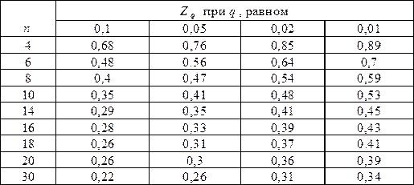

## Критерий Диксона

Достаточно мощный и удобный критерий для исключения грубой ошибки. 

# Определения

Для применения необходимо составить вариационный возрастающий ряд $$x_1<x_2<⋯<x_n$$. Критерий Диксона определяется:

$$K_D = \frac{x_n - x_{n-1}}{x_n - x_1}.$$

В случае, если расчетное значение критерия будет больше критического значения $$Z_q$$, то проверяемое значение считается промахом и отбрасывается. Критические значения критерия приведены в таблице.

# Пример

Было произведено шесть измерений расстояний между сваями. 
Получены следующие результаты: $$25.1; 25.2; 24.9; 25.6; 25.1; 25.2$$ м. Результат $$25.6$$ м существенно отличается от остальных. Произведем проверку, не является ли он промахом. Составим вариационный возрастающий ряд из результатов измерений: $$24.9; 25.1; 25.1; 25.2; 25.2; 25.6$$ м. Для крайнего члена этого ряда $$25.6$$ м расчетный критерий Диксона:

$$K_D = \frac{25.6 - 25.2}{25.6 - 24.9} = 0.57$$.

Как следует из таблицы, по этому критерию результат $$25.6$$ м может быть отброшен как промах при уровне значимости $$q = 0.05$$.

### [Вернуться на главную](/)
