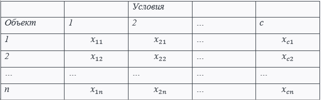
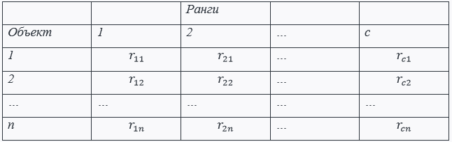
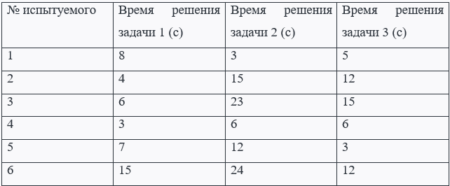
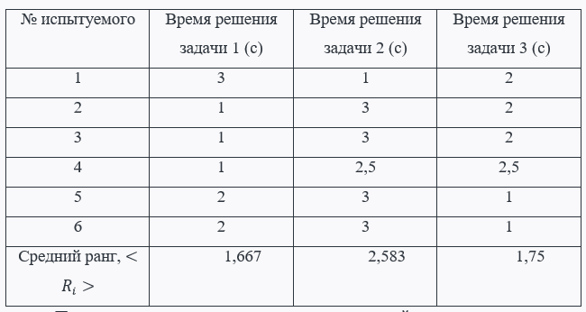

# Критерий Фридмана

Непараметрический статистический тест. Обобщение критерия Уилкоксона и применяется для сопоставления $$c$$ условий измерения $$c≥3$$ для $$n$$ объектов (испытуемых) с ранжированием по индивидуальным значениями измерений.

# Определения

Дана выборка из $$c$$ измерений для каждого из n испытуемых, которую можно представить в виде таблицы:

$$H_0$$ такова, что “между полученными в разных условиях измерениями имеются лишь случайные различия”. Выбирается уровень значимости.

Ранг - порядковый номер в вариационном ряду.

Сначала получаем таблицу рангов по строкам, при котором получаем ранги $$r_{ij}$$ объекта $$x_{ij}$$ при ранжировке $$x_{1j}, x_{2j}, ... , x_{cj}$$:

Суммы рангов и новые обозначения:

$$R_i = \sum_{j=1}^{n}r_{ij}, \overline{R_i} = \frac{R_i}{n}, \overline{\overline{R}} = \frac{c+1}{2}.$$

Для проверки гипотезы используем эмпирическое значение критерия – статистику:

$$S = \frac{12n}{c(c+1)}\sum_{i=1}^{c}R^2_i-3n(c+1).$$

$$H_0$$ принимается, если: 

$$S < S_\alpha (n,c)$$

Для малых значений $$n$$ и $$c$$ для крит. значения Фридмана существуют таблицы для различных значений уровня значимости $$α$$ или $$(1-α)$$.

# Пример

Психология. Шести школьникам предъявляют тест Ранена. Фиксируется время решения каждого задания. Результаты измерений приведены в таблице:

Будут ли найдены статистически значимые различия между временем решения первых трёх заданий теста?

Проверим гипотезу об отсутствии различий между временем решения заданий, используя критерий Фридмана. Нулевая гипотеза: различия между временем решения заданий у различных испытуемых отсутствуют.

Рассчитаем ранги для значений по каждой строке. Таблица рангов будет иметь следующий вид:

Пусть $$n$$ - число испытуемых, $$c$$ - число заданий. 

Средний ранг по всем наблюдениям равен $$\overline{\overline{R}} = \frac{c+1}{2} = 2$$

Значение статистики:

$$S = \frac{12n}{c(c+1)}\sum_{i=1}^{c}R^2_i-3n(c+1) = \frac{12 * 6}{3 * (4+1)}*0.514 = 3.083$$

По таблице критическое значение:

$$S_\alpha (n,c) = S_{0.05} (6,3) = 7$$

Расчётное значение статистики меньше критического. Нулевую гипотезу не отвергаем. Значения времени решения у испытуемых между заданиями существенно не отличаются.

Ярким примером использования данного критерия для подобных задач:

"Сварные швы, сделанные $$n$$ сварщиками с использованием $$c$$ сварочных горелок, были оценены по качеству. Есть ли отличия в качестве у какой-либо из горелок?"

" $$n$$ дегустаторов оценивают различные сорта вин. Имеют ли вина значимые отличия?"

### [Вернуться на главную](/)
