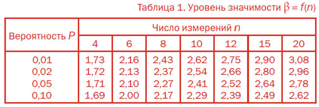

# Критерий Романовского

Критерий Романовского используется для исключения промахов (грубых погрешностей).

# Определения

Целесообразность: При $$n<20$$. 

Вычисляем отношение: 

$$|\frac{\overline{x} - x_i}{\sigma}| = \beta$$,

где $$\sigma - СКО$$.

и полученное значение сравнивают с теоретическим $$\beta_T$$ по таблице значимости:

Если вычисленное значение больше табличного, то результат отбасывают.

# Пример

При шестикратном измерении получены следующие результаты:  $$25.155; 25,150; 25.165; 25.165; 25.160; 25.180 м$$. Последний результат вызывает сомнения. Производится проверка по критерию Романовского, не является ли он промахом.
Находим среднее значение и СКО, получив $$25.163$$ и $$0.0107 m$$.

Вычисляем параметр $$\beta = 1.58$$. Берём уровень значимости $$0.05$$ и $$n = 6$$. Критическое значение $$2.1$$, следовательно результат - не промах.

# Критерий Шовине

Критерий Шовине используется для аналогичных целей.

# Определения

Целесообразность: При $$n<10$$

Промахом считается результат $$x_i$$, если разность $$|\overline{x} - x_i|$$ превышает значение $$\sigma$$, приведённое ниже в зависимости от числа измерений.

Пусть разность принимается за $$|\overline{x} - x_i| = \tau$$. Тогда:

$$
\tau>\left\lbrace
\begin{array}{ll}
1.6\sigma & \textrm{if n = 3} \newline
1.7\sigma & \textrm{if n = 6} \newline
1.9\sigma & \textrm{if n = 8} \newline
2\sigma & \textrm{if n = 10} \newline
\end{array}
\right.
$$

# Пример

Исследуем тот же пример. Вспомним, что среднее и СКО $$25.163$$ и $$0.0107 m$$. Возьмём сомнительный пример $$25.180$$.

$$\tau = 0.017$$. СКО, помноженное на коэффициент при $$n = 6$$ равно $$0,01819$$. Коэффициент $$\tau < 1.7\sigma$$, следовательно результат - не промах (впрочем, что и показал прошлый тест).

### [Вернуться на главную](/)
