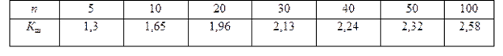
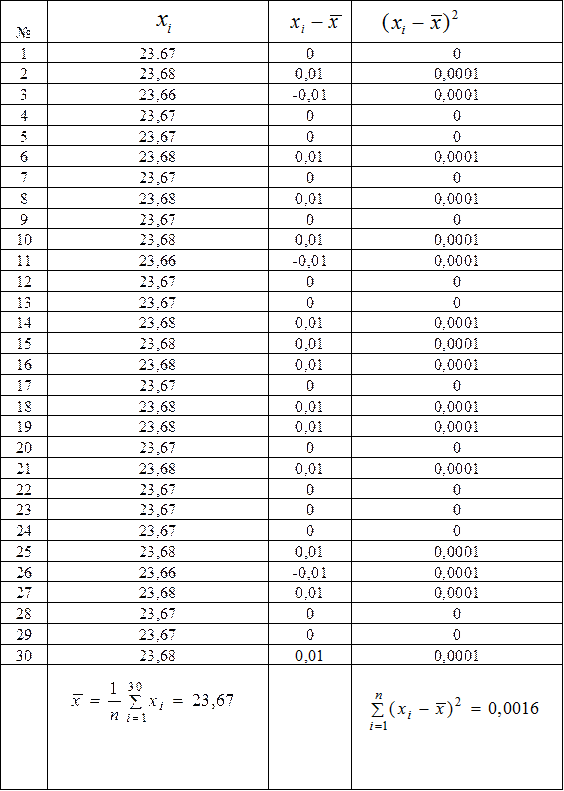

# Критерий Шарлье

Критерий Шарлье используют при более или равным двадцати измерений для отброса промаха.

# Определения

Пользуясь данным критерием, отбрасывается результат, для значения которого выполняется неравенство:

$$| \overline{x} - x_i | > K_Ш \sigma$$,

где $$\sigma - СКО$$, $$К_Ш - коэф. Шарлье (по таблице)$$:

# Пример

При измерении расстояний между колоннами были получены следующие результаты (см. табл.):

$$\sigma = 0.0074$$ m. Проверяем сомнительный результат измерения - $$23.66$$. Для этого значения не выполняется неравенство:

$$| \overline{x} - x_i | > K_Ш \sigma$$, $$К_Ш (n = 30) = 2.13$$, следовательно, сомнительный результат оставляем в ряду.

### [Вернуться на главную](/)
