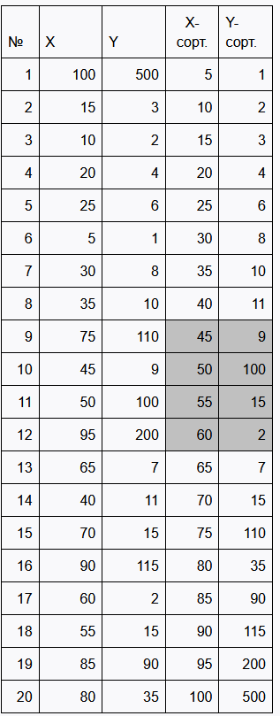

# Простейший пример проверки на гетероскедастичность

Существует множество статистических методов (тестов) для формальной проверки наличия гетероскедастичности, таких как тесты Голдфелда-Квандта, Бреуша-Погана, Уайта и Глейзера. Все эти тесты направлены на опровержение гипотезы о гомоскедастичности. Если гипотеза опровергается, это свидетельствует о наличии гетероскедастичности в модели.

Рассмотрим один из самых известных тестов — тест Голдфелда-Квандта (Goldfeld-Quandt, 1965) для выявления гетероскедастичности. При его применении предполагается однофакторная регрессия вида $$y = a_0 + a_1x + u$$, где стандартное отклонение пропорционально значению x. Метод заключается в оценке двух регрессионных линий с использованием метода наименьших квадратов (МНК). Первая линия создаётся на основе данных с минимальными значениями регрессионных остатков и дисперсией ошибки, а вторая — на основе данных с максимальными значениями остатков и дисперсией ошибки. Если значения остатков и дисперсий обеих регрессий схожи, то принимается гипотеза о гомоскедастичности. В противном случае можно утверждать о наличии гетероскедастичности в модели.

# Алгоритм

Тест состоит из следующих этапов:

1) Формулируются гипотезы $$H_0$$ = гомоскедастичность, $$H_1$$ = гетероскедастичность.
2) Располагаются данные в порядке возрастания величины $$x$$, пропорционально которой изменяется стандартное отклонение случайной составляющей.
3) Исключаются средние $$d$$ наблюдений. $$d$$ может быть выбрано, например, как 1/5 всех наблюдений.
4) Оцениваются две регрессии по формуле $$\hat{\alpha} = [X^T * X]^{-1} * X^T * Y,$$
   ($$X$$ - матрица независимых переменных, $$Y$$ - вектор-столбец зависимой переменной)
5) Вычислить сумму квадратов остатков (ошибок) для каждой из регрессий: $$RSS_1$$ для малых значений $$x$$, и $$RSS_2$$ для больших $$х$$, формула $$RSS = Y^T*Y - \hat{\alpha} * X^T * Y$$.
6) В предположении, что ошибки имеют нормальное распределение, статистика $$\frac{RSS_2}{RSS_1}$$ будет иметь F-распределение с $$0.5(n-d-4)$$ степенями свободы. Опровергается гипотеза о гомоскедастичности в выбранном уровне значимости, если вычисленная статистика превышает соответствующее критическое значение F-распределения.

Тест Голдфелда-Квандта может применяться не только в случае парной линейной регрессии. В случае множественной модели число степеней свободы F-распределения будет $$0.5(n-d-2k)$$. 

# Пример

Проверим однофакторную регрессионную модель $$y = -70.4 + 2.52x$$, построенную по данным таблицы методом МНК, на гетероскедастичность (тест Голдфелда-Квандта, 1% и 5%), исключив средние $$d=\frac{N}{5}$$ наблюдений, (N=20). 

1) Формулируются гипотезы $$H_0$$ = гомоскедастичность, $$H_1$$ = гетероскедастичность.
2) Располагаются данные в порядке возрастания величины $$x$$, пропорционально которой изменяется стандартное отклонение случайной составляющей. Поместим результаты в таблицу, как сортированные $$X$$ и $$Y$$.
3) Определим $$d=4$$ и исключим соответствующие данные из середины отсортированной выборки, получим две новые выборки.
4) Оценим параметры и RSS двух соответствующих регрессий по формулам.
Для первой регрессии:

$$[X^T*X]^{-1}=\begin{pmatrix}
 \begin{pmatrix}
1 & 1 & 1 & 1 & 1 & 1 & 1 & 1\\
5 & 10 & 15 & 20 & 25 & 30 & 35 & 40\\
\end{pmatrix}  \cdot & \begin{pmatrix}
1 & 5 \\
 1& 10 \\
1 & 15 \\
1 & 20 \\
1 & 25 \\
1 &  30\\
1 & 35 \\
1 & 40
\end{pmatrix} \\ 
\end{pmatrix}= \begin{pmatrix}
0.607143 & -0.021429 \\
-0.021429 & 0.000952
\end{pmatrix}$$

$$
X^T*Y=\begin{pmatrix}
1 & 1 & 1 & 1 & 1 & 1 & 1 & 1 \\
5 & 10 & 15 & 20 & 25 & 30 & 35 & 40 
\end{pmatrix}
*
\begin{pmatrix}
1 \\
2 \\
3 \\
4 \\
6 \\
8 \\
10 \\
11
\end{pmatrix}
= \begin{pmatrix}
45 \\
1330
\end{pmatrix}
$$

$$
\hat{\alpha} = 
\begin{bmatrix}
-1.1786 \\
0.3024
\end{bmatrix}$$

$$Y^T * Y = 351$$

$$\hat{\alpha}^T * X^T * Y = 349.131$$

$$RSS_1 = 351 - 349.131 = 1.869$$

Для второй регрессии:

$$RSS_2 = 63615.79$$

5) Рассчитаем $$\frac{RSS_2}{RSS_1} = 34037$$, число степеней свободы $$6$$.
Для уровня значимости $\alpha = 1%$ - $F_t = 8.47$
Для уровня значимости $\alpha = 5%$ - $F_t = 4.28$

Поскольку вычисленное значение 34037 больше табличных значений F – критериев при выбранных уровнях значимости 1% и 5%, то в обоих случаях принимается гипотеза о наличии гетероскедастичности.

### [Вернуться на главную](/)
